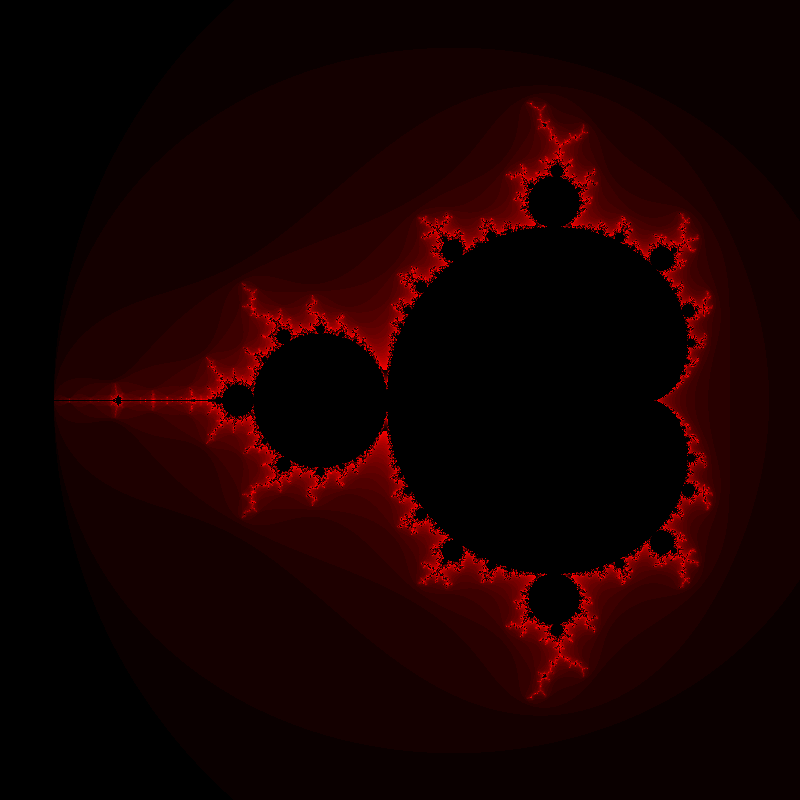

# Computation of the Mandelbrot set

This directory contains the sequential computation of the Mandelbrot set and
represents the starting point for the exam project. The output of the program is
a PNG image of the set.

## Dependencies

The program requires SFML and, for the parallel version, oneAPI Threading
Building Blocks (oneTBB), besides the usual compiler and build tools. Both are
available as Ubuntu packages. To install them:

```shell
sudo apt install libsfml-dev libtbb-dev
```

## Build

To build the program in both Debug and Release mode, follow the instructions given in [`code/README.md`](../code/README.md).

## Run

To run the program: _build-dir_`/mandelbrot`

where _build-dir_ is the CMake binary directory, chosen during the configuration step.

The program produces a PNG file called `mandelbrot.png` in the current directoy.


